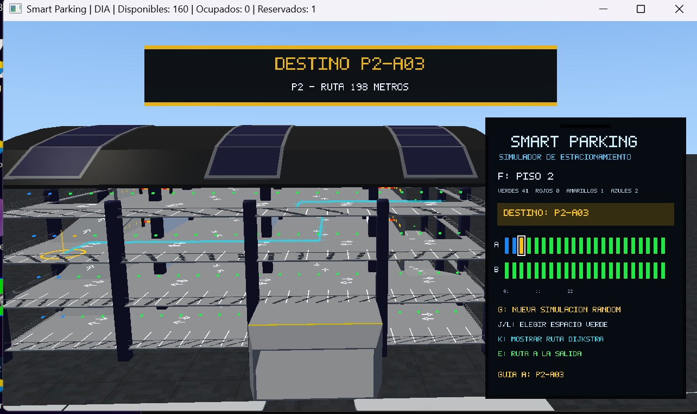
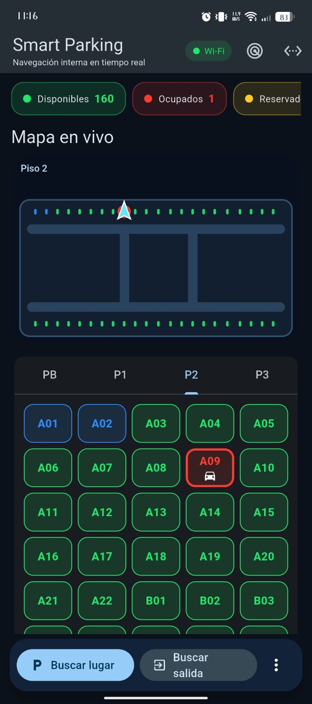
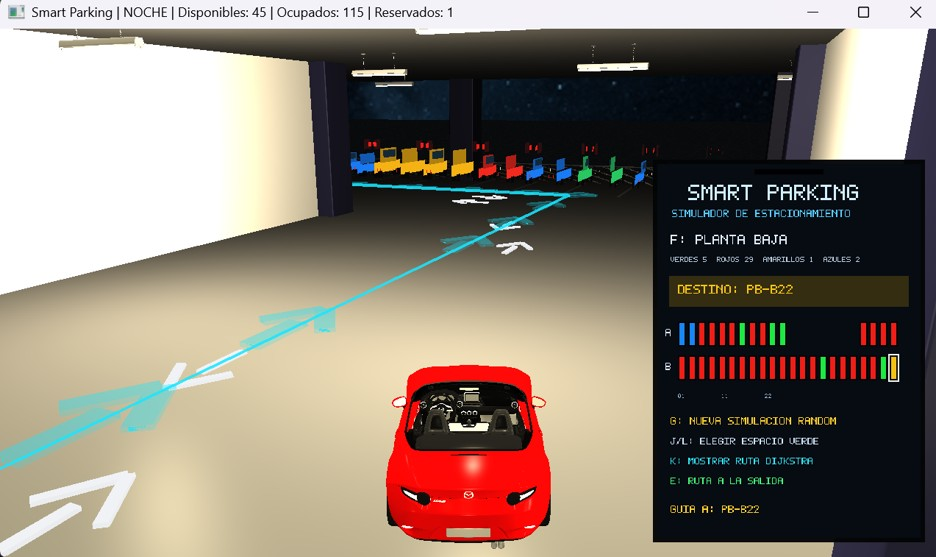
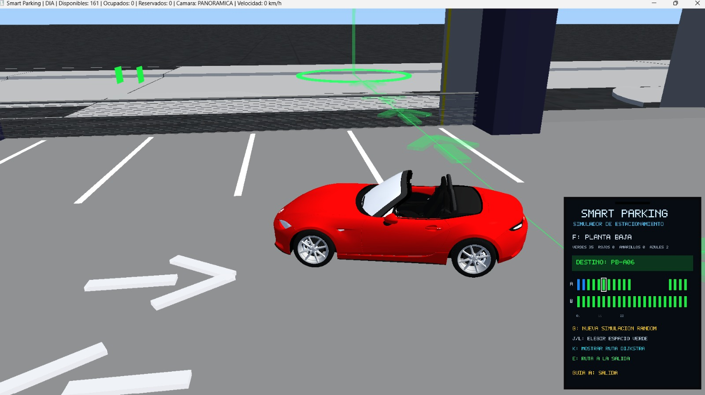
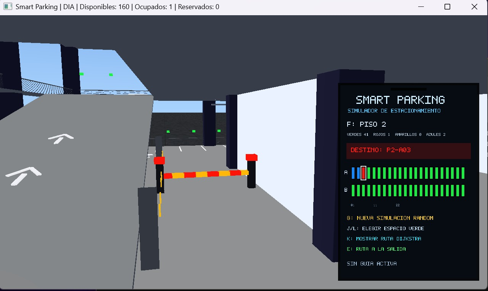

# Smart Parking EPN

Sistema de estacionamiento inteligente desarrollado con OpenGL, Flutter y FastAPI.

## Características principales

- Simulación 3D del estacionamiento.
- Aplicación móvil desarrollada en Flutter.
- Backend con FastAPI.
- Cálculo de rutas mediante el algoritmo de Dijkstra.
- Restricciones de circulación y detección de colisiones.
- Visualización de espacios disponibles, ocupados y reservados.

## Aplicación móvil

## Ruta calculada con Dijkstra

## Simulación 3D

## Restricciones y colisiones

## Documentación técnica

📥 **[Descargar Informe Técnico](docs/Informe_Tecnico_Smart_Parking.docx)**

## Tecnologías utilizadas

- C++
- OpenGL
- Flutter
- FastAPI
- Python
- Git
- GitHub
# 📄 Licencia

Proyecto académico desarrollado con fines educativos.
